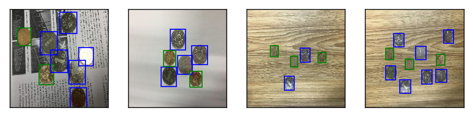

# CionCount
---------------

## 说明
这是一个针对中国硬币（五角和一元的）检测的小程序，使用的框架是[mxnet gluon](http://zh.gluon.ai/chapter_preface/install.html)，使用的检测框架为SSD，实验平台是jupyter notebook（可以使用pip install jupyter安装）。

## 运行测试
1. 在项目根目录下创建 models 目录，下载训练好的模型参数文件到 models 目录下，并重命名为sdl_coin_vgg11bn28_512x512_data_sizes.param，模型下载
```
链接: https://pan.baidu.com/s/1smD8nk5 密码: xr9s
```
如果需要的话也可以下载本工程的全部模型参数文件（一般不需要），下载链接在
```
链接: https://pan.baidu.com/s/1hr3cPDi 密码: 2ux9
```
2. 运行simple_demo.ipynb可以查看一张检测的效果图
3. 在项目根目录下创建 dataset 目录，下载数据sdl-coins.zip到dataset目录下，数据下载
```
链接: https://pan.baidu.com/s/1qYV2Y2w 密码: f225
```
4. 运行demo.ipynb进行整个数据集的预处理，然后加载模型数据，进行测试，查看ROC曲线和计算MAP值，以及可视化增强后的数据上的检测结果。

## 重新训练
1. 运行demo.ipynb下的数据预处理模块或者运行data\_prepare下面的data_prepare.ipynb脚本获取resize到256x256和512x512的图片数据和rec，idx，lst等文件。
2. 运行model_train下面的[train脚本](model_train/readme.md)进行训练和结果可视化


