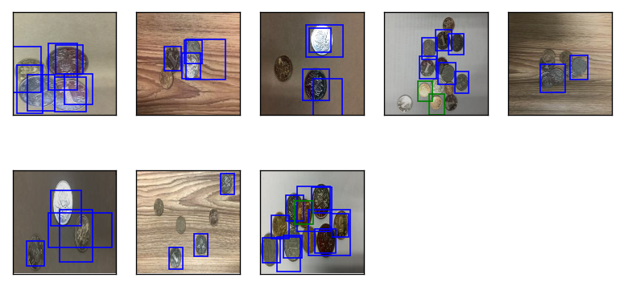
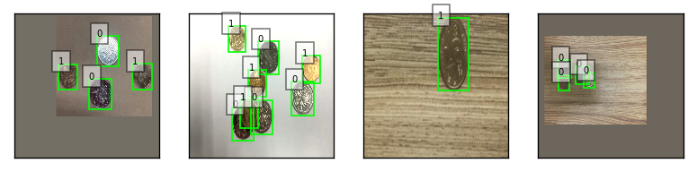

# 目录结构
### [一、train各个脚本说明](#1)
### [二、各个阶段脚本的检测效果](#2)
### [三、整个框架的基本流程](#3)
### [四、训练时候精度提升的几个关键步骤](#4)
#### [1. 模型充分训练（使用精度曲线炼丹）](#4.1)
#### [2. complex model and bigger input](#4.2)
#### [3. 数据和模型尺度问题（train 6）](#4.3)
#### [4. 根据目测的检测结果，分析检测失败的样本，制定策略](#4.4)
### [五、其他脚本](#5)

--------------------------------------------------------------------------------------------------------


## <h2 id="1">一、train各个脚本说明</h2>

框架code file | 说明
--- | ---
train1 | 直接使用官方训练 pikachu 检测的代码，换一下数据，改一下类别数，直接进行训练。目的是为了简单的把框架搭建起来，调试一下代码的正确性
train2 | 自己手写了一遍代码训练框架的全过程，train1是为了对比trian2的正确性。<br/>SSD的body net修改为vggbn11,mobilenet,alexnet三种，最后选择了vggbn11作为body net.
train3 | 1. 选择了输入256x256;<br/>2.body网络VGG11bn的前21层（3次pooling）pretrain,<br/>3.添加了AP值的计算函数作为评价标准辅助判断，<br/>4.添加了ROC曲线进行结果可视化;<br/>
train4 | **5.根据AP值的收敛曲线，修改lr的策略，达到一个很好的收敛结果，valid AP 达到0.8396**,<br/>lr_policy=('sgd', base_lr=0.3, lr_decay=0.5, wd=5e-4, lr_decay_epoch=[100, 150, 180]);
train5 | bigger input，将输入调整为512x512，对应的VGG11bn选前28层(4次pooling) prtrain;<br/>模型收敛加快，AP值没有太大提升，但目测的检测效果有所提升;<br/>检测复杂背景（书本背景）的效果上升，但是对于尺度较小的图片效果很差，甚至一个都检测不出来
train6 | 为了解决train5检测结果的尺度问题，采用了来跟你个策略：<br/>1.数据增强中添加多尺度（rand_pad+rand_crop）<br/>2.根据data_prepare/data_analysis.ipynb脚本分析数据中框的大小分布调整模型中的sizes参数<br/>两者结合最后在valid set上的AP值提升到了0.9048！！！！！！<br/>box预测的误差也大大减小了<br/>只是为了查看上面的策略是否有效，所以为了网络训练更快，这里使用256x256的输入图片(vgg11bn前21层)，对比前面256x256的效果<br/>
train7 | 输入为512x512(vgg11bn前28层)，同样收敛的更快，<br/>但是valid AP值并没有太大提升，而train AP获得了提升，<br/>获得的ROC曲线几近完美，目测效果也有很大提升,但同时速度满了很多<br/>

## <h2 id="2">二、各个阶段脚本的检测效果</h2>
### train1 (origin toy net framework)

### train2 (more complex body net)

### train3 (add right acc standard)

### train4 (adapt lr policy)

### train5 (bigger input image)
分析认为是尺度问题，也可能是色调问题

### train6 (scale data argument and data adaptive sizes_list choose)

### train7 (train6 + bigger input)


## <h2 id="3">三、整个框架的基本流程</h2>
1. 数据预处理
2. 数据加载、数据增强、数据可视化
3. 模型定义
4. loss定义
5. 模型训练
6. 结果可视化

### 流程中用到的工具代码
```
1. generally tool
    mkdir_if_not_exist
2. dataset transform
    resize_imageset、cal_mean、cal_mean_std、turn_SDL_to_SDL2
3. data prepared
    get_info_from_annotaions_VOC、get_info_from_annotaions_SDL、get_info_from_annotaions、list_image_det
4. data visualize
    show_image_SDL_annotation、show_images、show_9_images、show_det_result、show_det_results
5. data analysis
    get_all_boxes_from_annotations_SDL2
6. evaluate
    IOU、cal_scores_recall_prec、evaluate_MAP、draw_ROC、find_best_score_th
```

## <h2 id="4">四、训练时候精度提升的几个关键步骤 </h2>
### <h3 id="4.1">1. 模型充分训练（使用精度曲线炼丹）</h3>
一次大提升来自于对模型的充分训练，达到较好的收敛效果（炼丹，主要是调整迭代的epoch次数和sgd lr策略）,这需要一个能正确反映训练效果的精度标准，可以通过精度曲线的特点，辅助调节<br/>
举个例子，比如下图中我使用base_lr=0.3, lr_decay=0.1, 每隔50个epoch decay一次，AP曲线如下<br/>
<br/>
虽然曲线最后好像收敛了，但是很明显在epoch=50之前曲线有明显的上升趋势，但是50之后就开始迟缓，而epoch=50时候正好是lr_decay的时候，这很可能表明我们进行了过早的过大的lr_decay<br/>
所以调整一下lr的策略，在epoch=100的时候再lr_decay,延迟lr decay得到的AP曲线如下,可以发现AP值上升了10多个点，可见充分训练的重要性<br/>
<br/>而如果使用分类正确率作为评价标准:<br/>
由于正反例的比率相差太大，比如一张图片里的数据背景框有37000+个，而目标框只有467，所以即使我把所有框预测为背景，也有0.987的分类正确率，所以这个标准是无法用来辅助调整lr策略的，因为即使调整了也很难发现，因为两个策略的acc相差不大。
```
epoch 79 ('accuracy', 0.9816292401420524) ('mae', 0.015714746279021103) 0.450972 0.0417285449803
epoch 80 ('accuracy', 0.9824807127112417) ('mae', 0.014836864856382212) 0.460674 0.0396980848163
epoch 81 ('accuracy', 0.9814245040411462) ('mae', 0.015859515716632206) 0.451331 0.042099095881
epoch 82 ('accuracy', 0.981726824638746) ('mae', 0.015991133948167164) 0.484069 0.0432057138532
epoch 83 ('accuracy', 0.9828997520205731) ('mae', 0.014663477117816607) 0.46387 0.0388495102525
epoch 84 ('accuracy', 0.982985855988244) ('mae', 0.01431540617098411) 0.477016 0.0379766831174
epoch 85 ('accuracy', 0.9827447648787656) ('mae', 0.01506023264179627) 0.495928 0.0408211154863
epoch 86 ('accuracy', 0.9818932923095763) ('mae', 0.015101343082884947) 0.450572 0.0396220572293
epoch 87 ('accuracy', 0.9828289554249326) ('mae', 0.014775942079722881) 0.483156 0.0390666620806
epoch 88 ('accuracy', 0.9831217089150135) ('mae', 0.014432011793057123) 0.49005 0.0389600284398
epoch 89 ('accuracy', 0.9822166605437178) ('mae', 0.015194815583527088) 0.481405 0.0403952272609
epoch 90 ('accuracy', 0.9821783921136419) ('mae', 0.015260025858879089) 0.474295 0.0406343722716
epoch 91 ('accuracy', 0.982750505143277) ('mae', 0.014800246494511763) 0.46633 0.0395702468231
epoch 92 ('accuracy', 0.9816751622581436) ('mae', 0.015619830538829168) 0.490527 0.041064155288
epoch 93 ('accuracy', 0.9822377081802596) ('mae', 0.015297327811519304) 0.489533 0.0400545485318
epoch 94 ('accuracy', 0.9824539248101886) ('mae', 0.01527516171336174) 0.485513 0.0406572697684
epoch 95 ('accuracy', 0.9819966170707813) ('mae', 0.015079269806543985) 0.489327 0.0393696594983
epoch 96 ('accuracy', 0.9823946087435709) ('mae', 0.015214617053667704) 0.461878 0.0401758020744
epoch 97 ('accuracy', 0.982356340313495) ('mae', 0.014939147668580214) 0.473906 0.0389998741448
epoch 98 ('accuracy', 0.9832422544697527) ('mae', 0.014350553043186665) 0.482802 0.0381288481876
epoch 99 ('accuracy', 0.9827447648787656) ('mae', 0.014538686412076155) 0.474829 0.0383601598442
```

### <h3 id="4.2">2. complex model and bigger input</h3>
对于检测任务，更大的输入往往带来更多的信息，往往带来效果的提升（本实验中没有带来AP提升，但是带来了收敛速度和目测效果的提升）<br/>

之前关于数据增强的日志中已经说明了过拟合和拟合程度不足的表现（train acc和valid acc的关系）和他们的解决方法，其中过拟合常常使用wd,dropuout等模型策略，但更有力的其实还是数据上做功夫(新的数据，更强的数据增强)，而拟合策拟合程度不足可以通过使用更复杂的模型来解决<br/>

通常的，只要**数据做的足够好**，模型和参数使用的合理（**pretrain,模型输入、需要的模型输出等参数一致...**），越复杂的模型效果基本都是越好的。<br/>

### <h3 id="4.3">3. 数据和模型尺度问题（train 6）</h3>
为了解决尺度问题，我们采用了两个策略，强力数据增强（尤其是尺度方面），下面是增强后的示例图片：<br/>
<br/>
统计了数据中检测框的大小（统计脚本在../data_prepare/data_analysis.ipynb下）<br/>

于是我将sizes_list调整为
```
sizes_list = [[.2,.272], [.37,.447], [.54,.619],
                      [.71,.79], [.88,.961]]                  
===>>
sizes_list = [[ 0.10416667 ,0.17361111], [0.18624024, 0.34354575], [.37,.619],
                      [.71,.79], [.88,.961]]
```

其实加入尺度的data argument后，AP就上升到了0.89+(单独做过测试)<br/>
加入sizes_list的调整后，AP值上升不大，只是0.90+，但是定位误差笑了很多，mae由0.0039降低为0.0021<br/>
根据数据的分布设置网络具体参数实际上是一种trick，可能会降低泛化能力，但是能提高在这个数据集上的效果<br/>

我也尝试过使用六个尺度len(sizes_list)==6，同样定位误差降低了，但是AP值提升不明显<br/>
我也尝试过使得第一个预测层不是在Pooling 3次，而是pooling 4次，这样其实预测的anchorbox减少了，每个anchorbox对应的感受野增大了，但是对于AP值的变化也不是很明显<br/>


### <h3 id="4.4">4. 根据目测的检测结果，分析检测失败的样本，制定策略</h3>

## 五.、其他脚本
### model_analysis
由于默认的SSD各个预测层的输入的大小如下所示
```
predict scale 0 (8L, 512L, 32L, 32L) with (1L, 4096L, 4L) anchors
predict scale 1 (8L, 128L, 16L, 16L) with (1L, 1024L, 4L) anchors
predict scale 2 (8L, 128L, 8L, 8L) with (1L, 256L, 4L) anchors
predict scale 3 (8L, 128L, 4L, 4L) with (1L, 64L, 4L) anchors
predict scale 4 (8L, 128L, 1L, 1L) with (1L, 4L, 4L) anchors
0.0187969207764
(8L, 5444L) (8L, 5444L, 3L) (8L, 21776L) (8L, 21776L)
```
所以选择body网络时候，最好保证输出也是32x32，因此网络输入前使用该脚本确定应该导入前几层，使得body网输出为32x32

### evaluate
为了实现mxnet没有的计算AP值和绘制ROC曲线的代码，而写的测试

#### TODO
1. 将body网络的选择参数化, 对比不同body net的训练效果
